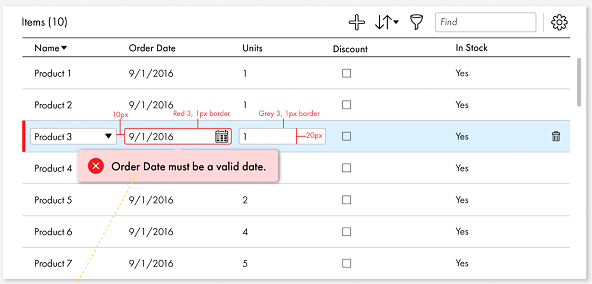

# Informatics document



## Designing [ Themable support] 

### 1.5 Weeks

## Functionality overview

### Grid Columns

1. Grid may have minimum one column and maximum 5 columns
2. Supported HTML elements or Data Type [ Also mentioned in design ]
    * Select element
        * Name columns is **Select** element.
    * Date element
        * Order date is **Date** element.
    * Integers or float
        * Units column contains **int** type data.
    * Boolean data type
        * Discount contains **Boolean** data.
    * String data type
        * In Stock contains data representation as string.
3. One more **TEXT Box** need to be add for determining column name on which filter operation would take place.

### Data FIltering [ **1.5 Weeks** ( Integrate with pagination functionality ) ]

Filter opeartion would operate on either specific or all columns based. Again we need to take care of provided column type, once user select specific column.

### Inline Add [ **3 Days** ]

Once user request for add operation, inline mode would be enable based on predefined columns type.

### Column Sorting [ **4 Days** ]

We need to take care of sorting based on 5 different types, that would be time consuming.

```javascript
{
    displayType: 'Predefined Options',
    sortFunc: function(){}
}
```

### Render data in tabular way [ **2 weeks** ]

* Date column would be configurable. User can provide desire format to render Date in specific format.
* String labels can be parsed before display. It would be useful in case if we want to restrict number of characters in column.
* Boolean type data need to display in terms of checkbox.

```javascript
{
    displayType: 'HTML element or string literal',
    useComponent: 'boolean',
    customComponent: 'Component Name',
    defaultText: 'Some Value',
    displayText: 'Desired format value',
    requiredParsing: 'boolean'
    parseFunc: function(){ }
}
```

### Inline editing includes validation [ **1.5 week** ]

When user enable inline edit mode, specific row data need to be re-render based on specific column type.

>Note: Rendering of columns, contain either **HTML element or literal string**, it would take time

### Pagination [ **3 Days** ]

* **Pagination** and **limit output rows** on page is not complex functionality but it needs efforts to make it robust.

### Other features [ **2 Days** ]

* Inline delete option
* Bulk delete

* Above estimates includes 2 POC
  * Make ReactJS application with I18n/L10N support and 508 compliance

> #### Supported browser would be Edge, Chrome and FireFox <br> Estimated time would be around 9 weeks excluding unit test cases. 
> In addition things mentioned above, we are not going to use any third party libraries excluding ReactJS default installation libraries.